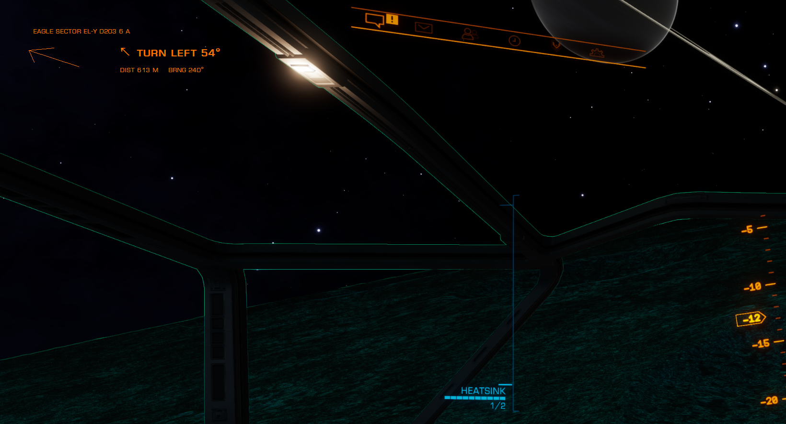
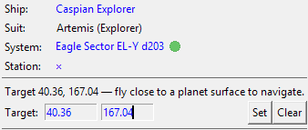

# EDPlanetNavigator

[](https://github.com/mcjohnso/EDPlanetNavigator/actions/workflows/test.yml)
[](https://github.com/mcjohnso/EDPlanetNavigator/releases/latest)
[](EDPlanetNavigator/LICENSE)

An [EDMarketConnector](https://github.com/EDCD/EDMarketConnector) (EDMC) plugin that helps you fly
to a target latitude/longitude on a planet in **Elite Dangerous**. It shows, live, which way to
turn, the bearing to the target, and the remaining distance — as an in‑game overlay and in the
EDMC window.

It is a modern, maintained replacement for the unmaintained
[EliteHIS](https://github.com/fiinnnn/EliteHIS) plugin.

<p align="center">
  
</p>

## Features

- **Turn guidance** — uses your ship's heading to say *turn left/right by N°*, with an on‑screen
  directional arrow, not just a raw compass bearing.
- **Automatic planet radius** — read from the game's `Status.json`, so distances are correct with
  nothing to type (manual override available).
- **Accurate distance** — great‑circle (haversine) surface distance in m / km / Mm.
- **Set a target anywhere** — type coordinates in the EDMC window *or* the settings tab; the target
  is remembered between sessions.
- **Works without the overlay** — if EDMCOverlay isn't installed, guidance still appears in the
  EDMC window instead of crashing.

## Installation

1. Download **`EDPlanetNavigator-vX.Y.Z.zip`** from the
   [latest release](https://github.com/mcjohnso/EDPlanetNavigator/releases/latest).
2. In EDMC, open *File → Settings → Plugins → “Open”* to reveal your plugins folder:
   - **Windows:** `%LOCALAPPDATA%\EDMarketConnector\plugins`
   - **macOS:** `~/Library/Application Support/EDMarketConnector/plugins`
   - **Linux:** `~/.local/share/EDMarketConnector/plugins`
3. Extract the zip there — you should end up with a `plugins/EDPlanetNavigator/` folder.
4. (Optional, for the in‑game overlay) install
   [EDMCOverlay](https://github.com/inorton/EDMCOverlay) or the compatible **EDMCModernOverlay**
   the same way.
5. Restart EDMC.

## Usage

Enter a **latitude** and **longitude** in the EDMC window and click **Set** (or set defaults in
*Settings → EDPlanetNavigator*). Fly near the planet and follow the turn arrow, bearing, and
distance, which update about once per second. Click **Clear** to stop.

<p align="center">
  
</p>

See the [plugin README](EDPlanetNavigator/README.md) for full usage and settings details.

## Building from source / cutting a release

The shippable plugin lives in [`EDPlanetNavigator/`](EDPlanetNavigator). To build the distributable
zip locally:

```sh
python package.py        # -> dist/EDPlanetNavigator-v<version>.zip
```

Releases are automated: bump `__version__` in
[`EDPlanetNavigator/load.py`](EDPlanetNavigator/load.py), update
[`CHANGELOG.md`](CHANGELOG.md), then push a matching tag:

```sh
git tag v1.0.0
git push origin v1.0.0
```

The [release workflow](.github/workflows/release.yml) builds the zip and publishes a GitHub Release
with it attached. The [test workflow](.github/workflows/test.yml) compile‑checks the modules and
runs the navigation self‑test on every push/PR.

## Credits

- Original **EliteHIS** plugin by **CMDR fiinnnn**; the "Help I'm Stuck" name was coined by
  **CMDR Hersilia**.
- Built on **EDMarketConnector** and **EDMCOverlay**.

## License

MIT — see [LICENSE](EDPlanetNavigator/LICENSE).
